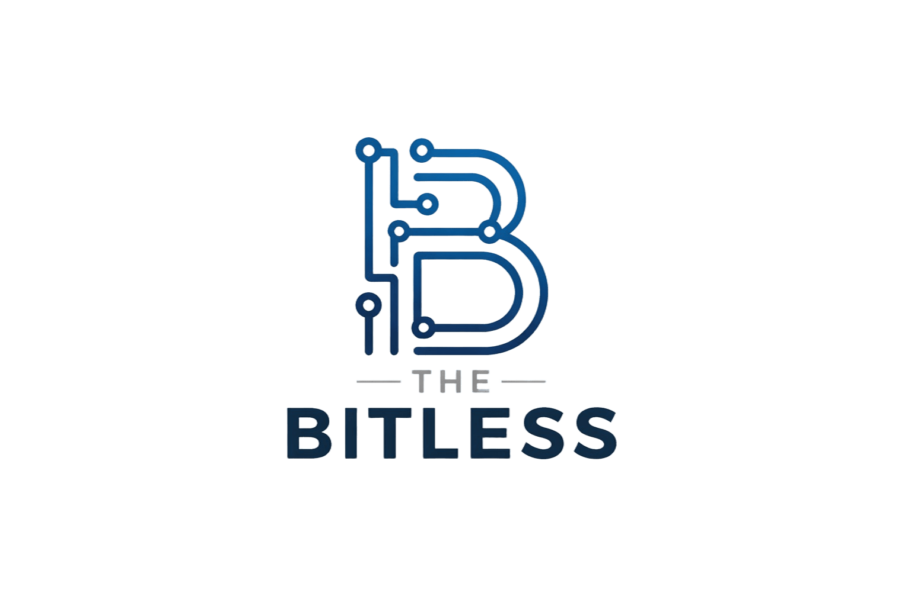

  

# Repository Documentazione - Gruppo TheBitLess

Questa repository contiene la documentazione ufficiale (sorgenti `.tex` e file `.pdf`) prodotta dal gruppo **TheBitLess** per il progetto del corso di **Ingegneria del Software** (A.A. 2025/2026) presso l'Università degli Studi di Padova.

## Struttura del Repository

La cartella principale è organizzata per facilitare la consultazione dei documenti relativi alle diverse fasi del progetto:

- **candidatura/**: Contiene i documenti prodotti per la fase di candidatura.
  - **analisi-capitolati/**: Documento di analisi dei capitolati proposti.
  - **verbali/**: Raccolta dei verbali degli incontri.
    - **verbali_esterni/**: Trascrizioni degli incontri con le aziende proponenti.
    - **verbali_interni/**: Trascrizioni delle riunioni di coordinamento del team.
- **templates/**: Contiene le risorse grafiche e i file di stile condivisi per la redazione dei documenti.

## Membri del Gruppo

| Nominativo | Matricola |
| :--- | :--- |
| Lorenzo Battistella | 2103116 |
| Edoardo De Piccoli | 2101055 |
| Davide Facco | 2087852 |
| Anna Marini | 2110986 |
| Andrea Menegaldo | 2116426 |
| Samuele Vendramin | 2111934 |
| Simone Zecchinato | 2113189 |

## Contatti e Link Utili

- **Sito Web (GitHub Pages):** [https://thebitless.github.io/](https://thebitless.github.io/)
- **E-mail di gruppo:** [thebitless.swe@gmail.com](mailto:thebitless.swe@gmail.com)